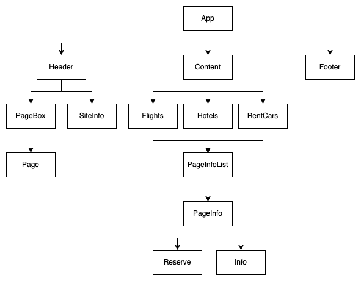

<h1>스카이스캐너 (SkyScanner) 웹 사이트 클론 코딩</h1>
<ul>
  <li><strong>학습 기간</strong> : 2021.12.27.(월) ~ 2022.01.02.(일)</li>
  <li><strong>사이트</strong> : <a href="https://www.skyscanner.co.kr/">https://www.skyscanner.co.kr/</a></li>
  <li><strong>참고</strong> : 일자별 계획 및 진행 상황, 학습 내용 등을 기술하였습니다.</li>
</ul>
 
<h4>학습 및 사용 기술 스택</h4>
<ul>
  <li>React</li>
  <li>React-router</li>
</ul>
 
<h4>일정</h4>
<ol>
  <li> 12.27 ~ 12.29 : React 및 React-router 학습</li>
  <li> 12.30 ~ 12.30 : 계획 및 구상</li>
  <li> 12.31 ~ 01.02 : 프로그래밍</li>
</ol>
 
<h4>기획</h4>
  <ul>
    <li>Dom Tree
       
      
    </li>
  </ul>
 
<h4>일자별 진행 상황</h4>
<table>
  <thead>
    <tr>
      <th>일자</th>
      <th>계획</th>
      <th>완료</th>
      <th>비고</th>
    </tr>
  </thead>
  <tbody>
    <tr>
      <th>
        12.27
         
        1일차
      </th>
      <td>
        React 공식문서 통한 기본 학습 진행
      </td>
      <td>
        React 프로젝트 생성 및 주요 개념 학습
         
        Component, Props, State, 조건부 렌더링, 이벤트 처리 등.. 학습
      </td>
      <td>
        -
      </td>
    <tr>
    <tr>
      <th>
        12.28
         
        2일차
      </th>
      <td>
        간단한 페이지 작성을 통한 연습
      </td>
      <td>
        간단한 TodoList 작성 페이지 제작 통한 연습
      </td>
      <td>
        -
      </td>
    </tr>
    <tr>
      <th>
        12.29
         
        3일차
      </th>
      <td>
        react-router-dom 학습
      </td>
      <td>
        router 사용한 페이지 전환을 위해 router 학습
      </td>
      <td>
        -
      </td>
    </tr>
    <tr>
      <th>
        12.30
         
        4일차
      </th>
      <td>
        계획 및 구상
      </td>
      <td>
        클론 코딩을 위한 간략한 계획 구상
         
        컴포넌트 구상
      </td>
      <td>
        -
      </td>
    </tr>
    <tr>
      <th>
        12.31
         
        5일차
      </th>
      <td>
        프로그래밍
      </td>
      <td>
        웹 페이지 헤더 부분 완성
         
        반응형 웹 구상 위해 특정 지점 분기
      </td>
      <td>
        -
      </td>
    </tr>
    <tr>
      <th>
        01.01
         
        6일차
      </th>
      <td>
        프로그래밍
      </td>
      <td>
        웹 페이지 예약 화면 배경 및 레이아웃 완성
      </td>
      <td>
        -
      </td>
    </tr>
    <tr>
      <th>
        01.02
         
        7일차
      </th>
      <td>
        프로그래밍
      </td>
      <td>
        예약 데이터 입력 폼 추가
         
        페이지별 추가 정보 사항 추가
      </td>
      <td>
        -
      </td>
    </tr>
  </tbody>
</table>
 

 
<h4>학습한 내용</h4>
<ul>
  <li>
    React 기반 웹페이지 제작 (함수형 컴포넌트 이용)
     
    자식 컴포넌트와 부모 컴포넌트간 데이터 및 이벤트 관리 방법 학습
  </li>
  <li>state HOOK 이용한 state 사용</li>
  <li>React-Router 이용하여 페이지별 라우팅 기능 구현</li>
  <li>CSS Flex 이용한 레이아웃 구성</li>
  <li>CSS 의사 클래스 사용법 학습 / 미디어 쿼리 이용한 반응형 웹 구현</li>
</ul>
 
<h4>부족한 사항 / 추가 학습 필요한 사항</h4>
<ul>
  <li>
    초기 계획 구상이 부족
     
    컴포넌트 세부 분류가 꼼꼼하지 못해 프로그래밍 과정에서 코드가 복잡해지고, 추가적인 컴포넌트가 계속 늘어남
  </li>
  <li>
    변수명 규칙 통일화 및 문서화 필요
     
    프로그래밍시 변수명 규칙을 따로 정하지 않아, 혼란을 주는 변수명 발생함
     
    특정 데이터를 관리하는 변수명 및 함수명을 문서화 또는 주석을 이용한 정리가 필요하다고 느낌
  </li>
  <li>
    프로그래밍 시작시 너무 많은것을 하려고 시도하여 어려워짐
     
    당일 프로그래밍 시작 전 레이아웃 틀을 크게 한개만 잡아두고 세부 컴포넌트를 제작하여 하나씩 채워나가는 방식으로 접근해 볼 필요가 있어보임
  </li>
</ul>